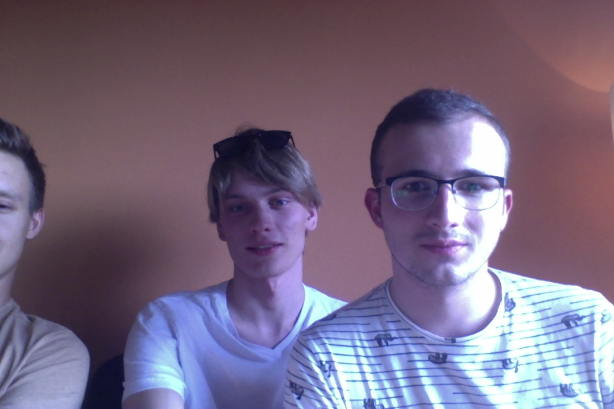
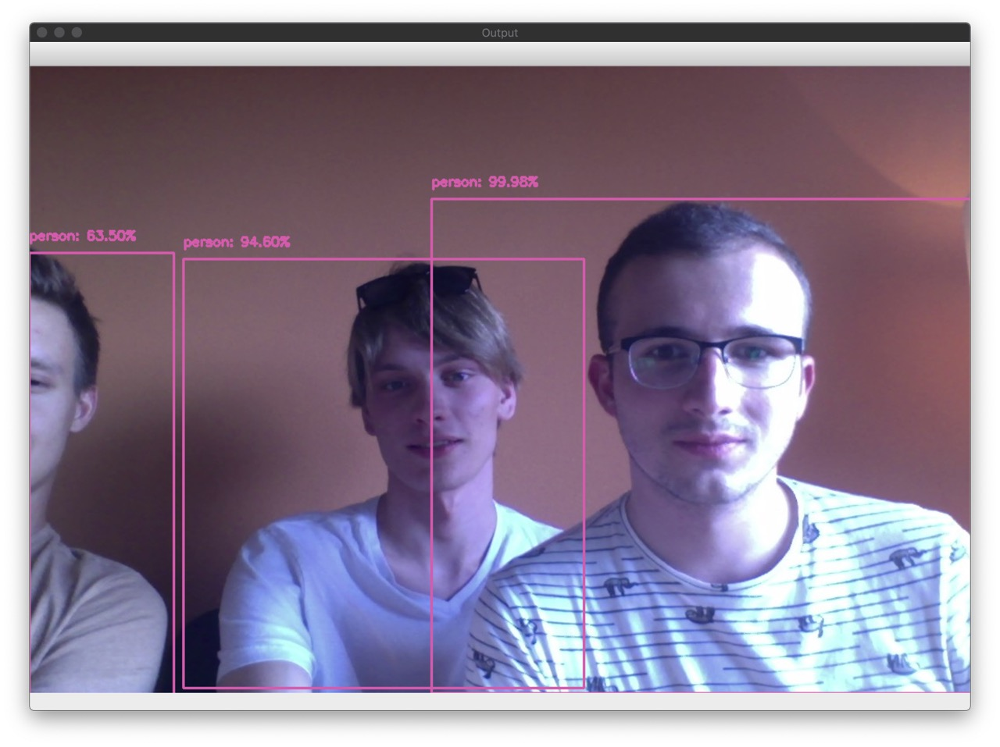
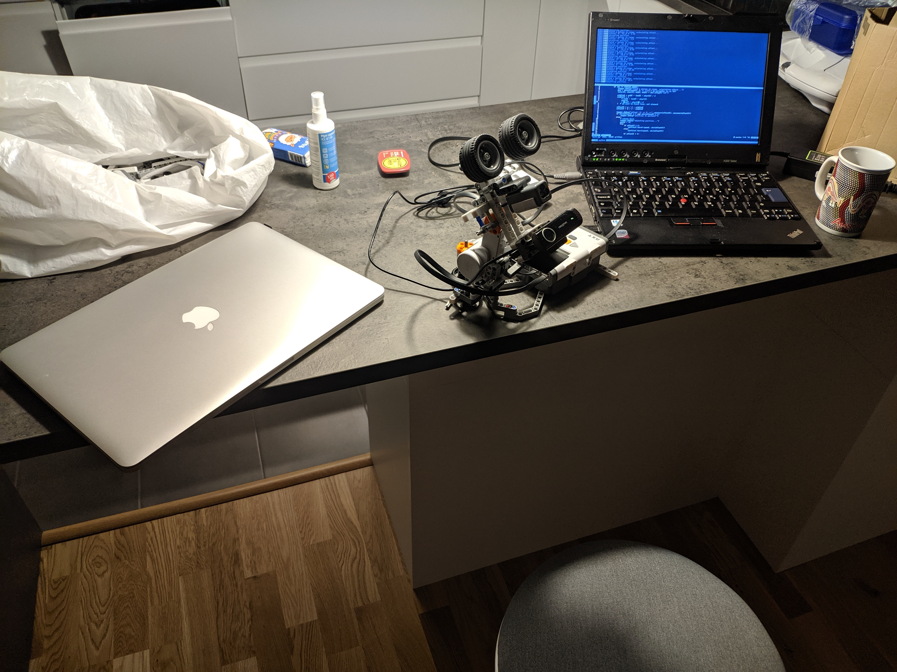

# Mycroft-NXT-Enclosure

# First step:

get object detection working, recognize person and then use it in next steps.

## Second step:

calculate object offset to rotate camera using NXT motors

issues:

- low range, can't rotate 360 (not even 90 I believe) on X axis. Around 180 degrees on Y axis.
- focused on looks instead of usability (Thanks Ola!) but, we're studying Social Informatics not Automation and Robotics so that's kinda fine I guess

it somewhat works:

[YouTube Video with demonstration](https://youtu.be/wuYpBmQ6b2w)

## Third step:

connect to Mycroft Voice Assistant API - message bus?

### Sources used:
- https://towardsdatascience.com/detecting-faces-with-python-and-opencv-face-detection-neural-network-f72890ae531c
- https://www.pyimagesearch.com/2017/09/18/real-time-object-detection-with-deep-learning-and-opencv/

### Libraries used:

- [nxt-python](https://github.com/Eelviny/nxt-python)
- [opencv-python](https://pypi.org/project/opencv-python/)
